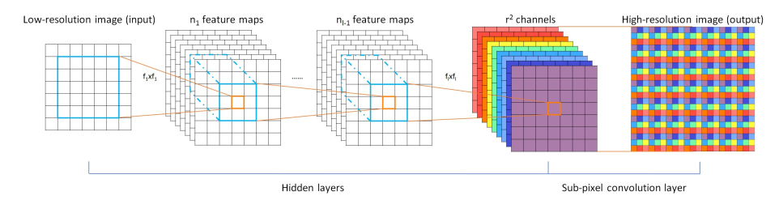
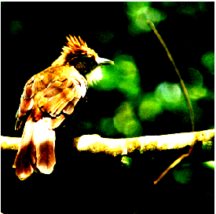
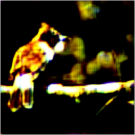
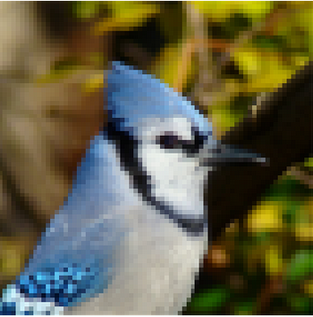
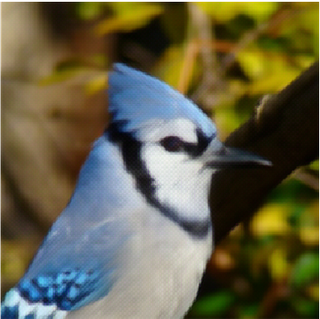

This repo contains implementations of papers related to Image Segmentation and Super Resolution. Many more papers to come.

# Super Resolution
## Papers to read
- [Perceptual Losses for Real-Time Style Transfer and Super Resolution](https://arxiv.org/abs/1603.08155)
- [Checkerboard artifact free sub-pixel convolution](https://arxiv.org/abs/1707.02937)
- [Enhanced Deep Residual Networks for Single Image Super-Resolution](https://arxiv.org/abs/1707.02921)
- [Real-Time Single Image and Video Super-Resolution Using an Efficient Sub-Pixel Convolutional Neural Network](https://arxiv.org/abs/1609.05158)

## Requirements
- Pytorch>=0.3
- Fastai

## Usage
```
$ python super.py
```

## Dataset
- ImageNet 10% sample

We're making use of Pixel shuffle
<p align='center'>

</p>




```
Original image
```
---


```
Output from Model (Using only Perceptual Loss and without icnr initialization
```
---


```
Input image
```
---


```
Output from Model (Using only Perceptual Loss and with icnr initialization
```


