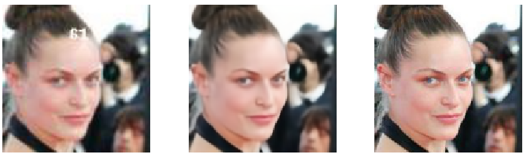
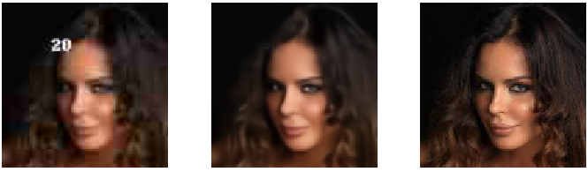

This repo contains implementations of papers Super Resolution. 

# Super Resolution
Two methods are being used to perform super resolution
- EDSR + Pixel Shuffling + Perceptual Loss
- Pre-trained GAN (traning Generator and critic seperately and then training both)

## Requirements
- Pytorch>=0.3
- Fastai 

## Usage
```
$ python super.py
```

## Dataset
- ImageNet 10% sample
- Celeb A 

### EDSR 
Requires Fastai==0.7 ([super_res_edsr.py](https://github.com/prajjwal1/super_resolution/blob/master/super_res_edsr.py))

In this method, We're making use of Pixel shuffle along with EDSR (Removal of BN in skip connection)
<p align='center'>

</p>


```
Original image
```
---


```
Prediction 
```
---


```
Input image
```
---


```
Prediction 
```  
---------------------------------------------------
.

### Pre Trained GANs
#### PreRequisites
- FastAI>=1.45
- Pytorch >= 1.0

#### Creating Low quality dataset
Use crappification from ([utils.py](https://github.com/prajjwal1/super_resolution/blob/master/utils.py))

We use a Unet Generator which has Resnet34/50 (Pretrained) as it's head (modifiable)
Generator is trained with low quality images with ground truth being images from original dataset.

When pretraining generator only, here's the output:

Input----------------------------------------------------Prediction------------------------------------------Target





Critic is trained on generator images and original images

#### Usage
Check the path variables carefully
```
$ python3 super_res_gan.py 
```

## References
- [Perceptual Losses for Real-Time Style Transfer and Super Resolution](https://arxiv.org/abs/1603.08155)
- [Checkerboard artifact free sub-pixel convolution](https://arxiv.org/abs/1707.02937)
- [Enhanced Deep Residual Networks for Single Image Super-Resolution](https://arxiv.org/abs/1707.02921)
- [Real-Time Single Image and Video Super-Resolution Using an Efficient Sub-Pixel Convolutional Neural Network](https://arxiv.org/abs/1609.05158)


